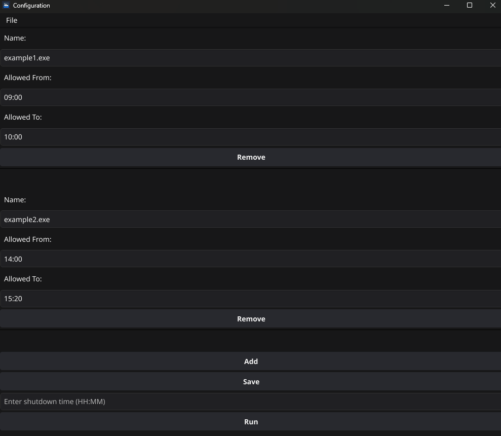
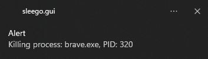
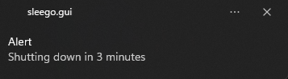

# Sleego

**Sleego** is a Go application designed to monitor and control the execution of processes based on specified schedules. It allows you to configure time restrictions for applications, forcefully terminating those running outside their permitted hours. Additionally, only the GUI version of Sleego supports scheduled system shutdowns.

## Table of Contents

- [Overview](#overview)
- [Features](#features)
- [Screenshots](#screenshots)
- [Configuration Structure](#configuration-structure)
- [Installation](#installation)
- [Execution Methods](#execution-methods)
  - [CLI Execution](#cli-execution)
  - [GUI Execution](#gui-execution)
- [Usage](#usage)
  - [Process Monitoring](#process-monitoring)
  - [Scheduled Shutdown](#scheduled-shutdown)
- [Notifications](#notifications)
- [Security and Considerations](#security-and-considerations)
- [Contributions](#contributions)
  - [Todo](#todo)
- [License](#license)

## Overview

Sleego monitors running processes based on a JSON configuration file that lists the processes to monitor and their allowed execution times. It periodically checks the running processes and immediately terminates any that are outside their specified schedule.
- **GUI Version:** In the GUI version, you can modify the configuration directly within the interface. After making changes, simply click the Save and Run button to reapply the new settings without needing to restart the application.
- **CLI Version:** In contrast, the CLI version requires you to stop the application and run it again to apply any changes made to the configuration file.

Additionally, **only the GUI version of Sleego supports scheduled system shutdowns**. This feature allows users to set a specific time for the computer to shut down automatically, providing enhanced control over system usage. Sleego also offers system notifications to inform users about process terminations and impending shutdowns.

> **Note**: Scheduled system shutdowns and real-time configuration updates are exclusively available in the GUI version of Sleego. Ensure you are using the GUI application to utilize these features.

## Features

- **Process Monitoring**: Terminates processes running outside their allowed time frames.
- **Scheduled Shutdown**: Shuts down the computer at a specified time with prior notifications.
- **System Notifications**: Provides alerts when processes are terminated and before system shutdown.
- **GUI with System Tray Support**: User-friendly interface with a system tray icon for easy access.

## Screenshots


*Figure 1: Sleego's main GUI interface.*

## Configuration Structure

The configuration JSON file should follow this format:

```json
[
    {
        "name": "app1.exe",
        "allowed_from": "08:00",
        "allowed_to": "18:00"
    },
    {
        "name": "app2.exe",
        "allowed_from": "09:00",
        "allowed_to": "23:20"
    }
]
```

- **name**: The name of the process (e.g., `app1.exe`).
- **allowed_from**: The allowed start time in HH:MM format.
- **allowed_to**: The allowed end time in HH:MM format.

## Installation

1. **Clone the repository**:

    ```bash
    git clone https://github.com/joaogabriel01/sleego.git
    cd sleego
    ```

2. **Install dependencies**:

    ```bash
    go mod tidy
    ```

3. **Install GCC (required for the GUI version)**:

    - **Windows**: Install [MinGW](https://www.mingw-w64.org/downloads/).
    - **macOS**: Install Xcode Command Line Tools:

        ```bash
        xcode-select --install
        ```

    - **Linux (Debian-based)**:

        ```bash
        sudo apt-get install build-essential
        ```

## Execution Methods

Sleego can be executed in two ways:

### CLI Execution

Run the command-line interface version located at `cmd/cli/main.go`:

```bash
go run ./cmd/cli/main.go -config="./config.json"
```

Or build and run the executable:

```bash
go build -o sleego_cli ./cmd/cli/main.go
./sleego_cli -config="./config.json"
```

### GUI Execution

Run the graphical user interface version located at `cmd/gui/main.go`:

```bash
go run ./cmd/gui/main.go
```

Or build and run the executable:

```bash
go build -o sleego_gui ./cmd/gui/main.go
./sleego_gui
```

**Note**: Ensure GCC is installed before running the GUI version.

## Usage

### Process Monitoring

When Sleego starts, it loads the provided configuration file and begins monitoring processes. It will forcefully terminate any processes running outside their allowed time frames.

#### Example Output

```
Starting process policy with config: [{name:app1.exe, allowed_from:08:00, allowed_to:18:00}, {name:app2.exe, allowed_from:09:00, allowed_to:23:20}] from path: ./config.json
```

### Scheduled Shutdown

Sleego's GUI includes an option to schedule a system shutdown at a specified time.

#### Setting Up a Scheduled Shutdown

1. Open the Sleego GUI.
2. Go to "Enter shutdown time (HH:MM) 
3. Set the desired time.
4. Click "Run".

Sleego will display notifications as the shutdown time approaches and before initiating the shutdown.

## Notifications

Sleego utilizes system notifications to keep you informed:

- **Process Termination Alerts**: Notifies you when a process is terminated due to schedule restrictions.

    
    *Figure 3: Notification when a process is terminated.*

- **Shutdown Warnings**: Provides alerts at set intervals before the scheduled shutdown time (e.g., 10 minutes, 3 minutes, 1 minute).

    
    *Figure 4: Notification before system shutdown.*

## Security and Considerations

- **Processes are forcefully terminated**: Sleego terminates any processes that do not meet the allowed times without warning. Ensure the configuration is correct to prevent terminating essential processes.
- **Scheduled Shutdown**: The system shutdown feature will close all applications and shut down your computer at the specified time. Save your work to prevent data loss.
- **Permissions**: Make sure you have the necessary permissions to close the listed processes and to initiate a system shutdown.
- **System Tray Access**: Sleego runs in the background and can be accessed via the system tray icon for convenience.

## Contributions

Contributions are welcome. Feel free to open an issue or submit a pull request.

### Todo

- **Application Groups**: Ability to create groups of applications with the same schedule.
- **Process Selection UI**: Ability to view running processes to facilitate adding processes to be monitored.
- **Enhanced GUI Visualization**: Add options for customizing themes (light/dark mode) and resizing the interface for better usability and readability.

## License

This project is licensed under the MIT License.
